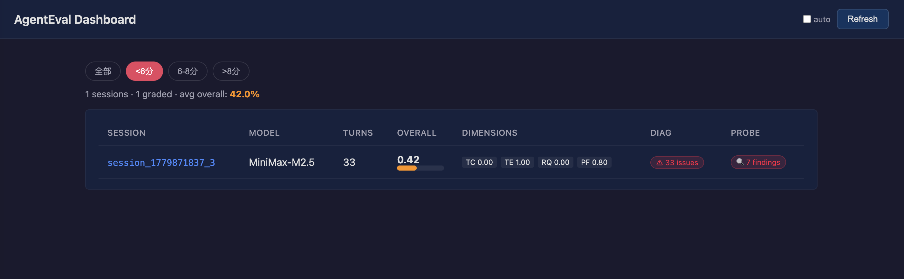
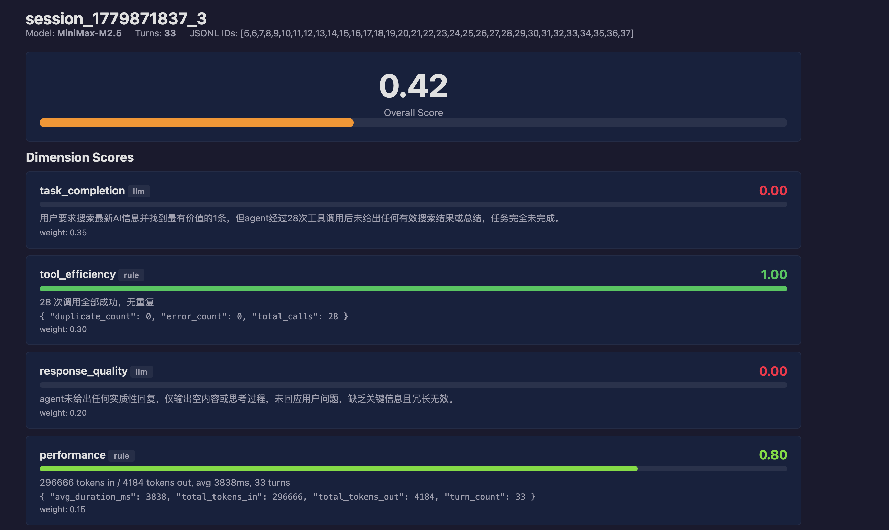
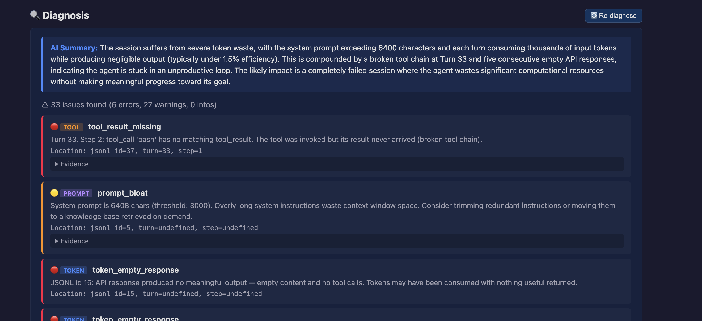
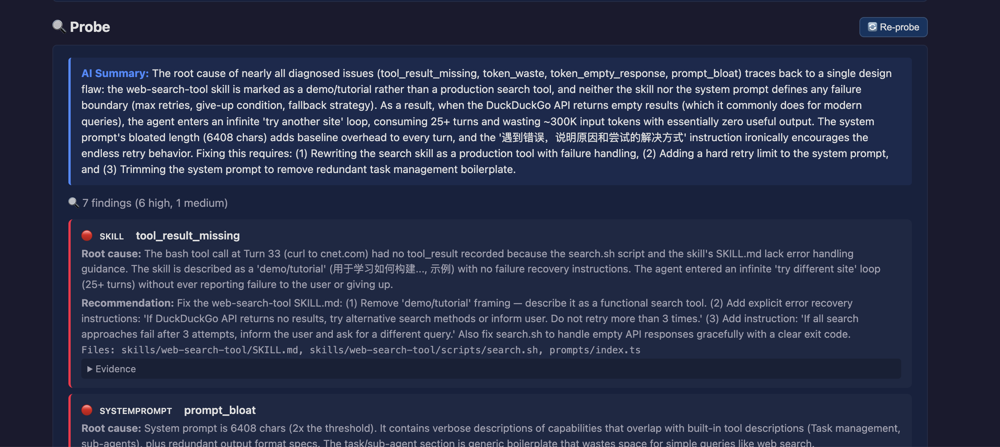

# AgentEval

A transparent HTTP proxy that captures Agent ↔ LLM API traffic, auto-splits sessions, builds structured conversation views, **grades** with multi-dimensional scoring, **diagnoses** behavioral issues via rule engine, and **probes** agent configuration for root causes — all with a built-in web dashboard.

*透明 HTTP 代理，捕获 Agent ↔ LLM 的 API 流量，自动切分 session、构建结构化视图、多维自动评分、规则诊断行为问题、探针审查配置根因 —— 内置 Web 评测面板。*

## How It Works / 工作原理

```
                         ┌──────────────────────────────┐
                         │   AgentEval (127.0.0.1:57633) │
                         └──────────────┬───────────────┘
                                        │
Agent ── HTTP ──► Proxy ── forward ──► Upstream LLM API
                    │
                    ├─ Raw traffic → logs/{stem}.jsonl
                    │  原始流量记录
                    ├─ Session detection (message rollback / idle timeout)
                    │  实时检测 session 边界
                    ├─ SessionView → logs/{session}.view.json
                    │  结构化会话视图
                    ├─ Auto-grade (rules + LLM judge) → logs/{session}.grade.json
                    │  自动评分（规则 + LLM 评审）
                    ├─ Diagnose (10 rule-based checks + LLM summary) → logs/{session}.diagnose.json
                    │  行为诊断（10条规则 + LLM 自然语言总结）
                    ├─ Probe (LLM agent reviews agent source config) → logs/{session}.probe.json
                    │  探针审查（LLM agent 审查被评测 agent 的 prompt/skills/tools 配置）
                    └─ Web Dashboard → http://127.0.0.1:57633/dashboard/
                       Web 评测面板
```

## Screenshots / 界面展示

### Dashboard / 面板列表



### Grader / 评分详情



### Diagnosis / 诊断结果



### Probe / 探针审查



## Quick Start / 快速开始

### 1. Configure `.env` / 配置

```bash
# Upstream LLM API / 上游 LLM 地址
AGENTEVAL_UPSTREAM=https://api.edgefn.net

# Proxy port / 代理监听端口
AGENTEVAL_PORT=57633

# Log directory / 日志目录
AGENTEVAL_LOG_DIR=./logs

# Judge LLM for grading, diagnosis summary, and probing / 评测 LLM（评分+诊断总结+探针共用）
AGENTEVAL_JUDGE_API_BASE=https://api.deepseek.com
AGENTEVAL_JUDGE_MODEL=deepseek-chat
AGENTEVAL_JUDGE_API_KEY=sk-xxx

# Source project directory for probe / 被探针审查的 agent 项目路径
PROBE_SOURCE_PROJECT_DIR=/path/to/your/agent/project
```

### 2. Start the proxy / 启动代理

```bash
cargo run
# listening http://127.0.0.1:57633 -> https://api.edgefn.net
# dashboard http://127.0.0.1:57633/dashboard/
```

### 3. Configure your Agent / 配置 Agent

Point your Agent's `BASE_URL` to the proxy.

*将 Agent 的 `BASE_URL` 指向代理地址。*

```bash
# Claude Code
export ANTHROPIC_BASE_URL=http://127.0.0.1:57633

# OpenAI SDK
export OPENAI_BASE_URL=http://127.0.0.1:57633/v1

# Generic
MODEL_BASE_URL=http://127.0.0.1:57633/v1 your-agent-command
```

### 4. View results / 查看结果

Open **http://127.0.0.1:57633/dashboard/** in your browser.

*浏览器打开上述地址查看评测面板。*

## Web Dashboard / Web 面板

### Session List / 会话列表

| Feature | Description |
|---------|-------------|
| Filter bar / 过滤 | 全部 / <6分 / 6-8分 / >8分，默认低分优先 |
| Pagination / 分页 | 超过 10 条自动分页，智能页码导航 |
| Score columns / 评分列 | Overall score + 4 dimension mini-bars / 总分 + 四维迷你进度条 |
| Grade button / 评分按钮 | Ungraded sessions show inline `[Grade]` button / 未评分会话可直接触發 |
| Diagnose badge / 诊断标记 | `⚠ N issues` / `✓ clean` / `[Diagnose]` button |
| Probe badge / 探针标记 | `🔍 N findings` / `✓ no findings` / `[Probe]` button |

### Detail View / 详情页

| Section | Description |
|---------|-------------|
| Grade / 评分 | Large overall score + 4 dimension cards with LLM judge reasons |
| Diagnose / 诊断 | **AI Summary** (LLM natural-language summary at top) + issue list (severity + category + detail + evidence) |
| Probe / 探针 | **AI Summary** (LLM overall assessment at top) + findings list (confidence + root cause + recommendation + evidence) |
| Conversation / 对话 | Expandable turns: user input + reasoning + text + tool calls + results |
| Scroll anchor / 锚点跳转 | Clicking diagnose/probe badge from list auto-scrolls to that panel |

## CLI / 命令行

```bash
# Run diagnosis on a session / 对某个 session 运行诊断
cargo run -- diagnose <session_id> [--format terminal|json]

# Run probe on a session (requires prior diagnosis) / 对某个 session 运行探针
cargo run -- probe <session_id>
```

## Session Splitting / Session 自动切分

| Trigger / 触发条件 | Behavior / 行为 |
|---|---|
| New conversation (message array rollback) / 用户开新对话 | Seal old session → background grade → start new session |
| 2-minute idle timeout / 2 分钟无新请求 | Same as above |
| Proxy shutdown / 进程退出 | Flush last session (synchronous grade) |

**Detection logic:** Normal conversations grow messages turn-by-turn. A new conversation "shrinks" back to just the system prompt + new question. When `common_prefix_len <= 1`, it's treated as a new session.

*正常对话 messages 逐轮增长，新对话 messages 会"回缩"。当 `common_prefix_len <= 1` 时判定为新 session。*

## Grading / 评分

Four weighted dimensions → overall 0–1 score. Rule metrics + LLM judge. Falls back to rule-based estimates if LLM is unavailable.

*四个加权维度 → 0-1 总分。规则统计 + LLM 评审。LLM 不可用时自动降级。*

| Dimension / 维度 | Source / 来源 | Weight / 权重 | What it measures / 衡量内容 |
|---|---|---|---|
| `task_completion` | LLM judge | 0.35 | Did the agent complete the user's task? / 是否完成用户任务 |
| `tool_efficiency` | Rule-based | 0.30 | Tool errors, duplicate calls, call patterns / 工具调用成功率、重复惩罚 |
| `response_quality` | LLM judge | 0.20 | Accuracy, conciseness, substance / 回复准确性、简洁性、实质性 |
| `performance` | Rule-based | 0.15 | Token efficiency, latency, turn count / Token 效率、耗时、turn 数 |

## Diagnose / 行为诊断

10 rule-based checks across 4 categories. Pure rule engine (no LLM). After rules run, an LLM generates a 2-3 sentence natural-language summary (best-effort, skipped if no API key).

*10 条规则检查，覆盖 4 个类别。纯规则引擎（不依赖 LLM）。规则运行后，LLM 生成 2-3 句自然语言总结（best-effort，无 API key 时跳过）。*

| Category / 类别 | Rules / 规则 | What it detects / 检测内容 |
|---|---|---|
| Tool (4 rules) | result_missing, result_error, duplicate_3plus, result_empty | Broken tool chain, retry loops, silent failures / 工具链断裂、重试循环、静默失败 |
| Prompt (2 rules) | bloat, context_overflow | Overlong system prompts, orphan tool call IDs / 系统提示过长、孤儿 tool call ID |
| Token (3 rules) | empty_response, waste, excessive_input | Empty responses, token waste, oversized input / 空响应、token 浪费、超大输入 |
| View (1 rule) | mismatch | Data integrity: turn count vs jsonl entries / 数据一致性校验 |

## Probe / 探针审查

An LLM agent with 4 read-only file tools enters the agent's source project directory (`PROBE_SOURCE_PROJECT_DIR`), reviews configuration files (CLAUDE.md, skills, prompts, tools), and identifies root causes for each diagnose issue. All recommendations are written to the report — **never auto-applied**.

*携带 4 个只读文件工具的 LLM agent，进入被评测 agent 的项目目录，审查配置文件（CLAUDE.md、skills、prompts、tools），找到每个 diagnose issue 的配置根因。所有改进建议写入 report — 绝不自动修改代码。*

| Tool | What it does | Safety limit |
|------|-------------|-------------|
| `read_file` | Read file contents / 读取文件 | 1MB truncation |
| `grep` | Search with regex / 正则搜索 | 1000 lines |
| `list_dir` | List directory entries / 列出目录 | — |
| `glob` | Find files by pattern / 按模式查找文件 | 2000 entries |

**Safety / 安全机制:**
- All paths sandboxed: `..` rejected, canonicalize verification / 路径沙箱：拒绝 `..` + 二次校验
- Loop detection: 3 identical calls → warning injected / 循环检测：3 次重复调用 → 注入警告
- Max 30 steps / 最多 30 步
- Read-only: no write/execute tools / 只读不写
- LLM timeout: 300s / LLM 超时 300 秒

## Output Files / 输出文件

```
{AGENTEVAL_LOG_DIR}/
├── {stem}.jsonl                 ← Raw recorded traffic / 原始流量
├── {stem}_{N}.view.json         ← Session structured view / 结构化视图
├── {stem}_{N}.grade.json        ← Grade report / 评分报告
├── {stem}_{N}.diagnose.json     ← Diagnosis report / 诊断报告
└── {stem}_{N}.probe.json        ← Probe report / 探针报告
```

## Configuration Reference / 配置参考

| Variable / 变量 | Default / 默认值 | Description / 说明 |
|---|---|---|
| `AGENTEVAL_UPSTREAM` | `https://api.deepseek.com` | Target LLM API / 上游 API 地址 |
| `AGENTEVAL_PORT` | `57633` | Local proxy port / 代理端口 |
| `AGENTEVAL_LOG_DIR` | `~/.agenteval/logs` | Log output directory / 日志目录 |
| `AGENTEVAL_VERBOSE` | `false` | Print request bodies / 打印请求体 |
| `AGENTEVAL_UI_ENABLED` | `true` | Enable web dashboard / 启用 Web 面板 |
| `AGENTEVAL_JUDGE_API_BASE` | same as upstream | Judge LLM URL / 评测 LLM 地址（评分+诊断总结+探针共用） |
| `AGENTEVAL_JUDGE_MODEL` | `MiniMax-M2.5` | Judge LLM model / 评测 LLM 模型 |
| `AGENTEVAL_JUDGE_API_KEY` | (empty) | Judge LLM API key / 评测 LLM API Key |
| `PROBE_SOURCE_PROJECT_DIR` | (empty) | Agent source dir for probe / 被探针审查的项目目录 |

## Docs / 文档

| Document / 文档 | Content / 内容 |
|---|---|
| [proxy.md](docs/proxy.md) | Proxy architecture / 代理架构 |
| [eval-design.md](docs/eval-design.md) | Eval module design / Eval 模块设计 |
| [eval-impl.md](docs/eval-impl.md) | Eval module implementation / Eval 模块实现 |
| [grader-design.md](docs/grader-design.md) | Grader design / Grader 方案设计 |
| [grader-impl.md](docs/grader-impl.md) | Grader implementation / Grader 实现细节 |
| [diagnose-design.md](docs/diagnose-design.md) | Diagnose design / Diagnose 方案设计 |
| [diagnose-impl.md](docs/diagnose-impl.md) | Diagnose implementation / Diagnose 实现记录 |
| [probe-design.md](docs/probe-design.md) | Probe design / Probe 方案设计 |
| [probe-impl.md](docs/probe-impl.md) | Probe implementation / Probe 实现记录 |
| [llm-summary-impl.md](docs/llm-summary-impl.md) | LLM summary for diagnose + probe / LLM 总结实现 |
| [web-ui-plan.md](docs/web-ui-plan.md) | Web UI design plan / Web UI 设计计划 |
| [web-ui-impl.md](docs/web-ui-impl.md) | Web UI implementation / Web UI 实现记录 |
| [dataflow.md](docs/dataflow.md) | Data flow / 数据流 |
